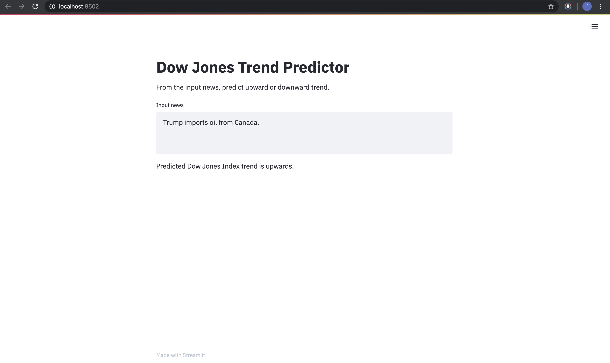

# Down Jones Trend Predictor Web Application  
Author: Xavier M. Puspus  


### Description
I used a sample dataset found [here](https://www.kaggle.com/aaron7sun/stocknews#Combined_News_DJIA.csv). I built a model that predicts stock trends based on news.
  
### Model

I used simple ensemble methods using news text data as features to predict 1 for upward trend, and 0 for downward.

### Deployment Through Web Application

I used the most recently released API of [Streamlit](https://streamlit.io) to deploy the ml model and locally serve the web app.

### Running the App

In order to run the app, you must have the basic data science packages available on your machine, (`pandas`, `numpy`, `matplotlib`, `sklearn` and install streamlit using:

```console
foo@bar:~$ pip install streamlit
```
Afterwards, `cd` into the directory of `app.py` and run this on the terminal:

```console
foo@bar:~$ streamlit run app.py
```

### Display

The web app should look something like this:


